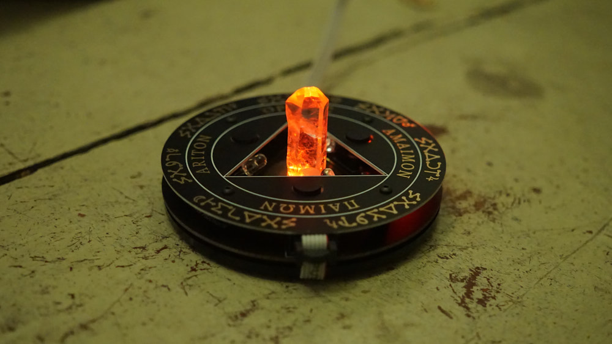

# Pocket Psithemius

The Psithemius is a psionic device for spirit conjuration and magical manifestation.

Its basic architecture consists of printed circuit boards hosting concentric circles with magical names and symbols and a triangle with a spiral shaped transmitter in its center. The design is based on a system attributed to the German abbot and polymath Johannes Trithemius who lived around the end of the 15th century and developed methods for communing with transdimensional entities.

For the Psithemius device to work properly, a quartz crystal is needed. The device emits light and an electromagnetic field around and into this quartz crystal set in the center of the triangle that acts as a focal point and spirit medium.

The Psithemius device utilizes principles from Psionics to detect and electrically amplify intent in the form of magical sigils or radionic rates sent to it. The goal is to charge the crystal with energies resonating with the nature of an entity and act as a beacon of condensed intent to attract them to the ritual space.

## Get the Psithemius

You can purchase a Pocket Psithemius directly from Sublunar Psionics. It comes in three different versions. All versions come with a USB power cable and a small carry bag.

* Fully assembled device (EUR 99.00)
* DIY kit incl. PCBs and all components (EUR 69.00)
* PCBs only - without components (EUR 49.00)

[Operator Manual](MANUAL.md)

[Assembly Instructions](hardware/ASSEMBLY.md)

[BOM List of Components](hardware/BOM.csv) / [PDF](hardware/BOM.pdf)

[Component Images](hardware/parts_preview.pdf)

## Code the Psithemius

Modify the firmware that runs the Psithemius or write your own from scratch. It's all fully Arduino compatible.

[Arduino IDE Firmware](firmware/)

## Fork the Psithemius

You can download the KiCAD project files (schematic, circuit board design, gerber files) and manufacture your own Psithemius or modify it

[KiCAD Files](hardware/)